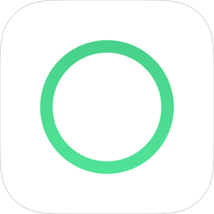
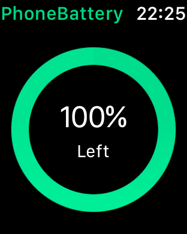
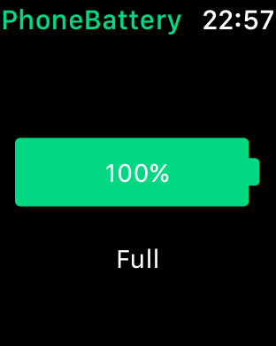
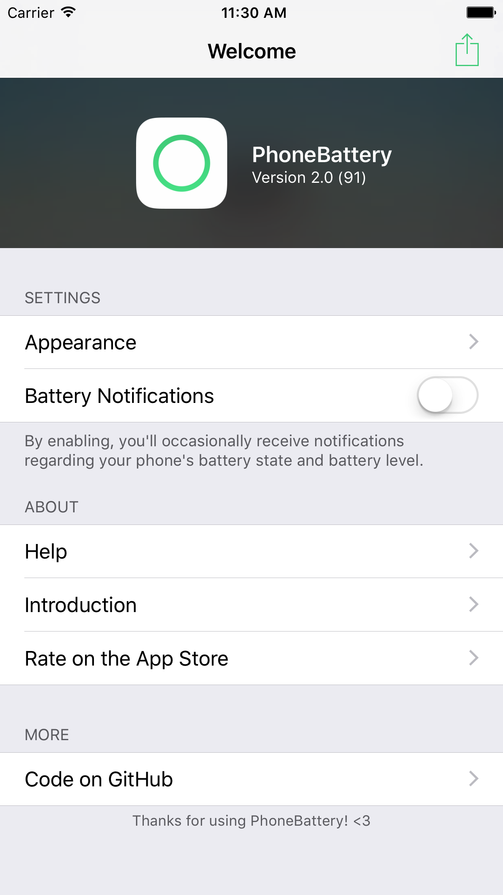
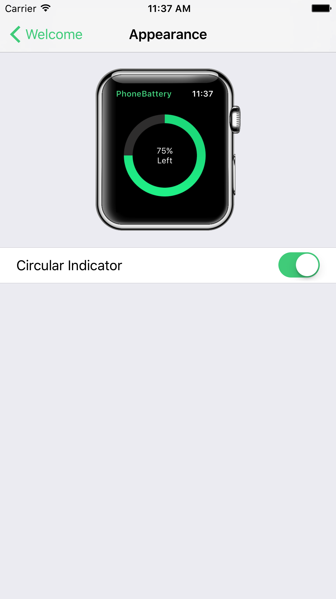
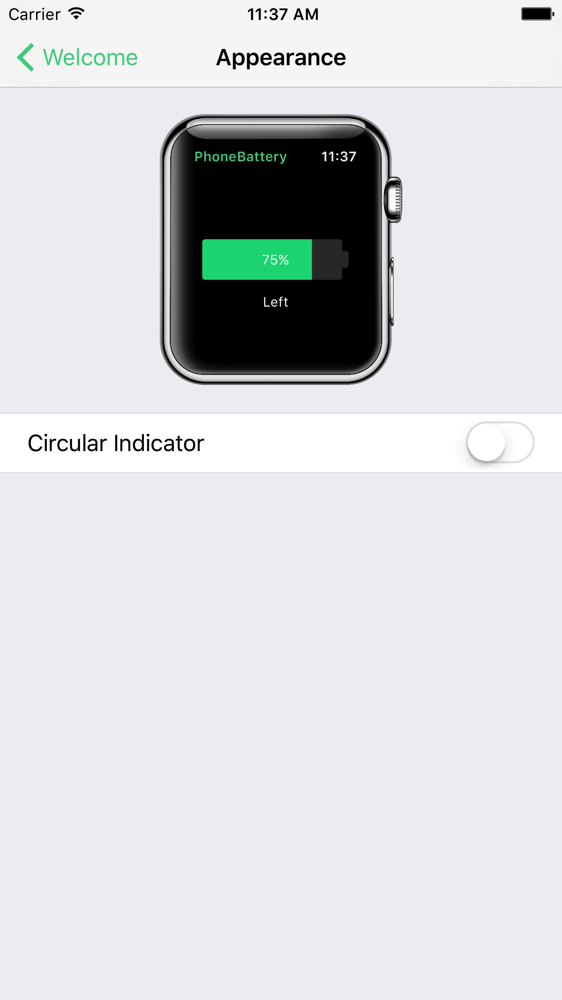
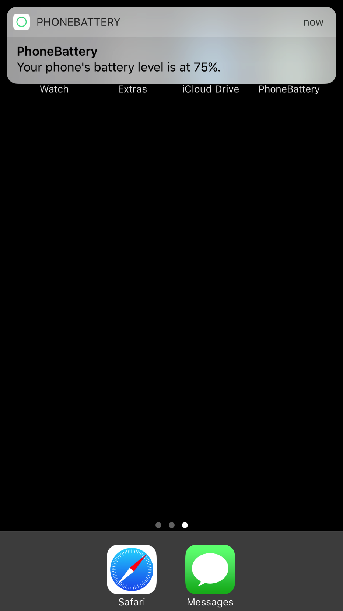

# PhoneBattery
PhoneBattery is a simple utility that lets you check your phone's battery life on your Apple Watch. It is very simple and doesn't do anything else than that.

PhoneBattery is also **available for free** on the [App Store](https://itunes.apple.com/us/app/phonebattery-your-phones-battery/id1009278300?ls=1&mt=8)! Please leave a rating, if you like PhoneBattery!

**Features**

* battery status notifications 
* two different watch interfaces to choose from
* display your phone's battery level on your Apple Watch
* battery states such as low power, charging, low battery etc.
* no ads, no IAPs

### System Requirements

* Requires iOS 10 or later
* Requires watchOS 3 or later

You can also download an old build [here](https://github.com/marcelvoss/PhoneBattery/releases/tag/1.0.2), that is compatible to iOS 8 and watchOS 1.

### Localization
| Language |  Localizer                                      |
|----------|------------------------------------------------ |
| German   | [Marcel Voss](https://github.com/marcelvoss)    |
| French   | [Julia Grill](https://github.com/juliastic)     |
| Spanish  | [Faisal Misle](https://github.com/fm)           |
| Italian  | [Giovanni Trezzi](https://twitter.com/yoller_)  |
| Chinese (Simplified) | [Jurvis Tan](https://twitter.com/jurvistan)  |
| Chinese (Traditional)  | [Jurvis Tan](https://twitter.com/jurvistan)  |

Thanks to everyone!

## Other Contributers
Thanks to [Joe Dawson](http://joedawson.me) who created PhoneBattery's gorgeous icon.

## Preview
**Apple Watch application** 
 

**iOS application** 

## License
Although, PhoneBattery's license doesn't stop you from publishing it on the App Store, I would highly appreciate it, if you wouldn't publish it on the store. Thanks! Nevertheless, according to the GPLv3 license, **you have to disclose your code**, if you do so.

While PhoneBattery 1 is available under the [MIT license](https://github.com/marcelvoss/PhoneBattery/blob/2f5485bf5a3854e05e8fd1a66cb5704a609088a0/LICENSE.md), version 2 and later is available under the GNU General Public License v3.0 (GPLv3). See the [LICENSE](https://github.com/marcelvoss/PhoneBattery/blob/master/LICENSE.txt) file for more information.
